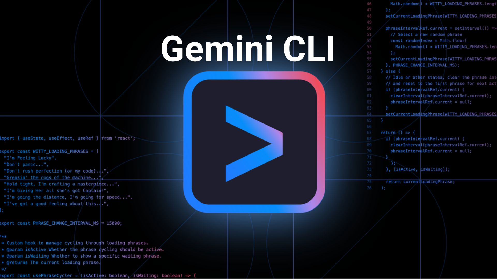

# FinTrack - Gestor de Finanças Pessoais e Orçamentos

FinTrack é um aplicativo de gestão financeira pessoal completo, desenvolvido com **React Native (Expo)** e agora turbinado com um backend **Node.js/Express** e banco de dados **MongoDB**. O projeto segue rigorosos padrões de **Clean Code**, arquitetura modular e testes automatizados.

## 🚀 Funcionalidades

- **Dashboard Financeiro:** Visualização de saldo total e monitoramento de orçamentos.
- **Gestão de Transações:** Fluxo completo de criação e listagem de receitas/despesas persistidas na nuvem.
- **Controle de Orçamentos:** Monitoramento visual de limites de gastos por categoria.
- **Analytics:** Gráficos detalhados de gastos mensais e detalhamento por categoria.
- **Metas de Economia:** Acompanhamento de progresso para objetivos financeiros.
- **Segurança e Sincronização:** Dados armazenados de forma segura em banco de dados MongoDB Atlas.

## 🛠️ Tecnologias Utilizadas

### Frontend (Mobile)
- **Framework:** [React Native](https://reactnative.dev/) (Expo SDK 56).
- **Linguagem:** [TypeScript](https://www.typescriptlang.org/).
- **Tematização:** Sistema de temas customizado (`src/theme`).
- **Navegação:** [React Navigation](https://reactnavigation.org/).
- **Ícones:** [Lucide React Native](https://lucide.dev/).

### Backend (Server)
- **Runtime:** [Node.js](https://nodejs.org/).
- **Framework:** [Express](https://expressjs.com/).
- **Banco de Dados:** [MongoDB Atlas](https://www.mongodb.com/atlas) (via Mongoose).
- **Padrão:** MVC (Models, Controllers, Routes).

## 📂 Estrutura de Pastas (Clean Code)

### App Mobile (`src/`)
- `src/theme/`: Centralização de cores, espaçamentos e estilos globais.
- `src/components/`: Componentes modulares e reutilizáveis (`TransactionItem`, `Button`, etc).
- `src/screens/`: Telas estruturadas com sub-componentes para maior legibilidade.
- `src/services/`: Camada de integração com a API (`financeStorage.ts`).
- `src/types/`: Definições globais de tipos TypeScript.

### Backend (`server/`)
- `server/config/`: Configurações de conexão com banco de dados.
- `server/controllers/`: Lógica de negócio e tratamento de requisições.
- `server/routes/`: Definição de endpoints da API.
- `server/models/`: Schemas do Mongoose para persistência de dados.

## 📦 Como Executar

### 1. Configurar o Backend
1. Navegue até a pasta do servidor:
   ```bash
   cd server
   ```
2. Instale as dependências:
   ```bash
   npm install
   ```
3. Configure o arquivo `.env`:
   - Copie o exemplo e adicione sua `MONGODB_URI` (MongoDB Atlas).
4. Inicie o servidor:
   ```bash
   npm start
   ```

### 2. Inicie o App Mobile
1. Na raiz do projeto, instale as dependências:
   ```bash
   npm install
   ```
2. (Opcional) Ajuste o IP da API em `src/services/apiConfig.ts`.
3. Inicie o Expo:
   ```bash
   npx expo start
   ```

## 🧪 Suíte de Testes

- **Unitários (Jest):** `npm test` - Focados em componentes UI e lógica de telas.
- **E2E (Cypress):** `npm run test:e2e` - Testes de integração de fluxos críticos (Web).

---
*Este projeto foi refatorado utilizando princípios de Clean Code para garantir alta manutenibilidade e escalabilidade.*


